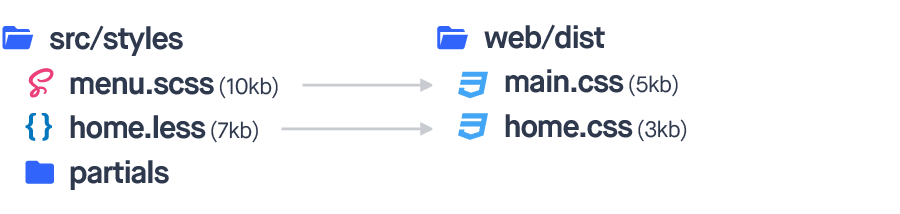
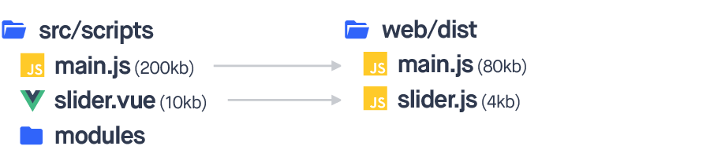
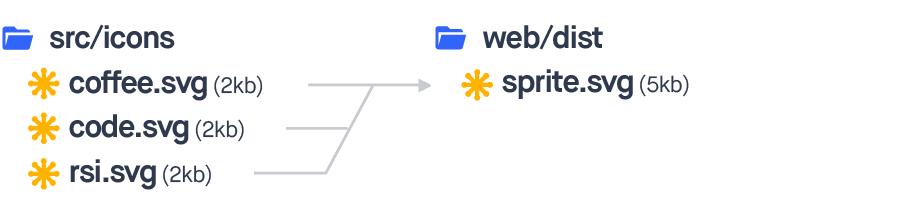
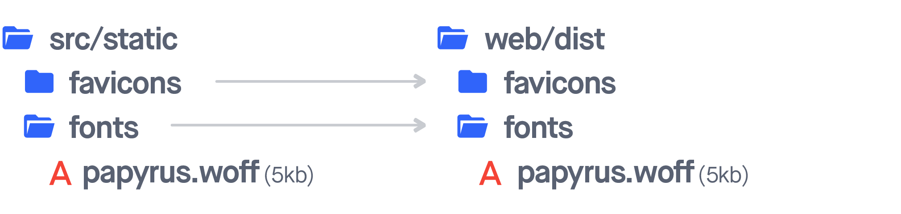

# Agency Webpack-Mix Config

<p></p>

Featuring a top-class developer experience and simple filing system for your project assets, this config provides a solid platform for your next website (or web app).

## Features

### Modern mainstream defaults

Use next generation JavaScript and CSS with polyfills automatically applied to the browsers you choose to support.

### Frictionless media additions

After starting the dev-server, add new project files or npm libraries without having to restart the server. Generate additional style and script outputs just by adding them to their `src` directory.

### Minimal config files

Avoid excessive build configuration files with all config defined in `webpack.mix.js`.<br>
The `package.json` contains browser targets and linting configs.

### Source folder aliases to reduce folder traversals

This means more `images/resource.jpg` with less `./../../images/resource.jpg` when you include assets.

### Sensible configuration complexity

Because of the complexity of raw Webpack configs, they can take an extended time to understand. [Laravel Mix](https://laravel.com/docs/5.8/mix#introduction) provides a simple layer upon Webpack to help make many build adjustments quick and painless.

## Build actions

### `src/styles`

Style files are compiled to CSS and PostCss plugins provide additional transformations and optimisations.

<p></p>

#### Details

-   [Sass](http://sass-lang.com) / [Less](http://lesscss.org) auto compiling, prefixing, minifying and sourcemaps
-   [CriticalCSS](https://github.com/addyosmani/critical) and [PurgeCSS](https://www.purgecss.com/) come preconfigured to improve your page speed
-   [Autoprefixer](https://github.com/postcss/autoprefixer) and [PostCSS Preset Env](https://github.com/csstools/postcss-preset-env) provide support for older browsers
-   [StyleLint](https://github.com/stylelint/stylelint) provides error linting for oopsies

<br>

### `src/scripts`

Script files are transpiled to vanilla JavaScript and the necessary polyfills included.

<p></p>

-   Script transpiling with [Babel](https://babeljs.io) with minifying and sourcemaps
-   Automatic polyfills are provided by core-js 3
    Uses dart-sass which has a replica API to Node-Sass
-   [ESLint](https://eslint.org/) is provided for error linting

<br>

### `src/images`

Images are optimized and copies to build directory.

<p></p>

-   Optimisations are provided by [Imagemin](https://github.com/imagemin/imagemin)

<br>

### `src/icons`

Individual SVG icons are optimised then combined into a single cacheable SVG.

<p></p>

-   An async script adds the svg sprite to your page
-   You can display an icon with svg use:<br/>

```html
<svg><use xlink:href="icon-code" /></svg>
```

<br>

### `src/static`

Additional folders with no transform requirements are copied to your build folders.

<p></p>

<br>

## Getting started

### 1. Copy this repo into a new project folder:

```bash
npx degit ben-rogerson/agency-webpack-mix-config
```

&hellip;or use Github's new tool to [create a new repository](https://github.com/ben-rogerson/agency-webpack-mix-config/generate).

### 2. Install the dependencies:

```bash
npm install
```

### 3. Add your project files

In this example I'll merge in the files from the [Craft CMS starter](https://github.com/craftcms/craft) on Github:<br>

```bash
npx degit --force craftcms/craft
# or
# npx degit --force https://bitbucket.org/user/repo
```

## Tasks

The following tasks are available:

```bash
npm run dev
# Run the development server

npm run start
# Run the development build

npm run build
# Run the production build

npm run fix-scripts
# Fixes your javascript with eslint

npm run fix-styles
# Fixes your styles with stylelint
```
